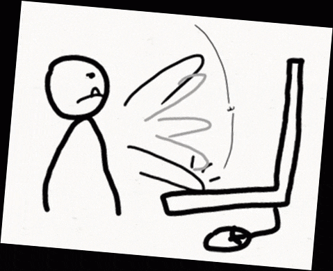

<h2 align="center">.about( )</h2>

⚙️ DevOps Engineer  
💻 Backend Developer  
🎮 Gamer &nbsp;|&nbsp; 👾 Memer &nbsp;|&nbsp; 💡 Tech Enthusiast
🎮 Gamer • 👾 Memer • 💡 Tech Enthusiast
🎮 Gamer / 👾 Memer / 💡 Tech Enthusiast
🎮 Gamer 👾 Memer 💡 Tech Enthusiast

###

<h2 align="center">.stats( )</h2>

  

###

<!--

  
<h2 align="center">🎁 Support</h2>

  
Thank you for your support!

  | Coin (Network)                                  | Address                                    |
  | ----------------------------------------------- | ------------------------------------------ |
  |  Bitcoin   | bc1qsayxc4zk269p7javts93s3dytae28qzgrav63y |
  |  BNB  | 0xDD016B921Cb19Df0231252F87d76cf76fC6193cd |
  |  ETH    | 0xDD016B921Cb19Df0231252F87d76cf76fC6193cd |
  |  USDT      | TRQQYTPxb541rHRondrvjMKjKGUbQFth1g         |

-->
